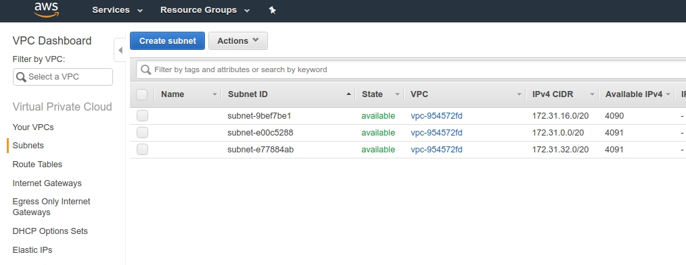
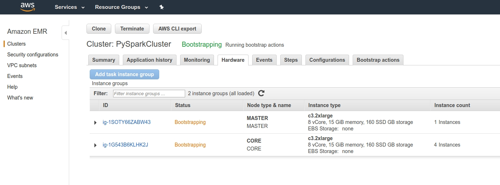
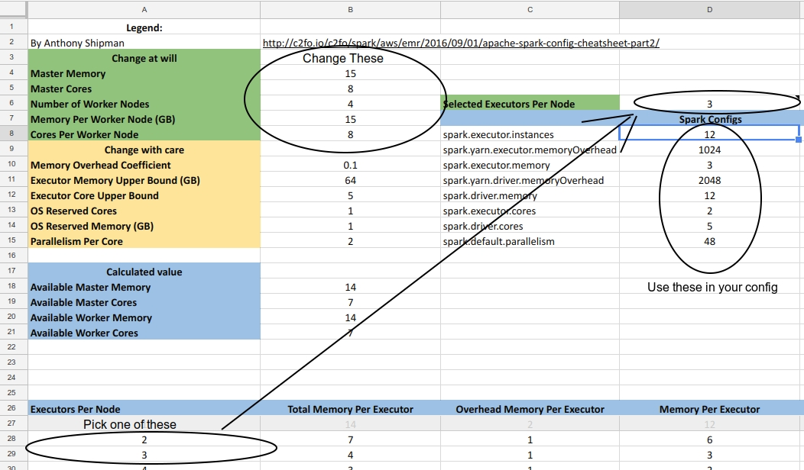

## How to configure AWS clusters

To Begin:  
Choose an instance configuration:  
Here is a wonderful website (https://www.ec2instances.info/) that updates from amazon and displays information about all of the instance types, including older instances like m3: (enable the EMR pricing column to check EMR prices, and keep in mind that the EMR price is in addition to the instance cost). You can check to see if instances are VPC-only as well.

A VPC is basically a private virtual network in your AWS account; before VPC Amazon used EC2-Classic, where you would share a network with others.
If an instance is VPC only, you need to provide a subnet (a range of IP addresses in your VPC) for your default VPC (which AWS should have already created for you) when you launch your cluster.
To find your subnet, go to the AWS console, make sure you're in the correct region, type VPC into the AWS services box, and click on subnets. When you use the AWS command line interface, you need to add the subnetid to the --ec2-attributes argument, like below. (or change just mine!)

To determine how many workers to use, look at your EC2 instance limits. To view a comprehensive list of instance limits, go to the AWS console, make you're in the right region, search for EC2 and then click limits on the top left side. You can see that many instances have a current limit of 0 or 1. If you need more, you will need to request a limit increase.
This page coupled with the ec2instances.info will help you decide on a good cluster. For example if you have a limit of five instances of c3.2xlarge, you can use one for your master and four as workers for a total of 40 vCores and 75GiB of memory.




I made a launch clusters script using EMR version 5.16.0 (which loads spark 2.3.1 by default), with instance type, debugging enabled for diagnosing failed clusters, as well as Ganglia and Spark. Ganglia allows you to monitor your cluster in much more detail than the EMR page, similar to a task manager.

#### launch_cluster.sh
```
#!/bin/bash

# Takes three arguments:
#   s3 bucket name - one that has already been created
#   name of key file - without .pem extension
#   number of worker instances
#      ex. bash launch_cluster.sh mybucket mypem 2

# This script assumes that the file emr-config.sh is
#   in your current directory.

# Requires the awscli to be set up, need to have correct default region configured
# Run `aws configure` to set this up

# require for first time cluster creators.
# you can comment this out if you are sure
# that the default emr roles already exist
aws emr create-default-roles

aws s3 cp emr-config.sh s3://$1/scripts/emr-config.sh

aws emr create-cluster \
    --enable-debugging \
    --log-uri s3://$1/MyLogs \
    --name PySparkCluster \
    --release-label emr-5.16.0 \
    --applications Name=Spark Name=Ganglia \
    --ec2-attributes KeyName=$2,SubnetIds=subnet-0dc89157 \
    --use-default-roles \
    --instance-groups \
      InstanceGroupType=MASTER,InstanceCount=1,InstanceType=c3.2xlarge \
      InstanceGroupType=CORE,InstanceCount=$3,InstanceType=mc3.2xlarge \
    --bootstrap-actions Path=s3://$1/scripts/emr-config.sh
```

Now let's bootstrap to install anaconda and other packages:
I had another script before but often got a boostrap timeout, which was caused by several reasons; one being that the bootstrap script was trying to install on /mnt1, which existed on older EC2 instances that had a drive attached to them, whereas newer instances often have EBS only storage and no extra mount point. I ended up downloading a new bootstrap script and modifying it a bit; it looks like this:

#### bootstrap-emr.sh
```

WS EMR 5.4.0 bootstrap script for installing/configuring Anaconda, additional
# Python packages, Tensorflow w/Keras, and Theano
# Modified from David Ziganto (dziganto.github.io)
# ----------------------------------------------------------------------
#  move /usr/local to /mnt/usr-moved/local; else run out of space on /
# ----------------------------------------------------------------------
sudo mkdir /mnt/usr-moved
sudo mv /usr/local /mnt/usr-moved/
sudo ln -s /mnt/usr-moved/local /usr/
sudo mv /usr/share /mnt/usr-moved/
sudo ln -s /mnt/usr-moved/share /usr/

# ----------------------------------------------------------------------
#              Install Anaconda (Python 3) & Set To Default
# ----------------------------------------------------------------------
wget https://repo.continuum.io/archive/Anaconda3-5.2.0-Linux-x86_64.sh -O ~/anaconda.sh
bash ~/anaconda.sh -b -p $HOME/anaconda
echo -e '\nexport PATH=$HOME/anaconda/bin:$PATH' >> $HOME/.bashrc && source $HOME/.bashrc

# ----------------------------------------------------------------------
#                    Install Additional Packages
# ----------------------------------------------------------------------
conda install -y psycopg2 gensim
pip install textblob selenium

# ----------------------------------------------------------------------
#         Install Tensorflow (CPU only and installs Keras )
# ----------------------------------------------------------------------
conda create -yn tensorflow
source activate tensorflow
pip install --ignore-installed --upgrade https://storage.googleapis.com/tensorflow/linux/cpu/tensorflow-1.1.0-cp35-cp35m-linux_x86_64.whl
source deactivate


# ----------------------------------------------------------------------
#        Download NLTK
# ----------------------------------------------------------------------

sudo $HOME/anaconda/bin/python -c "import nltk; \
nltk.download('stopwords', '/mnt/usr-moved/share/nltk_data'); \
nltk.download('punkt', '/mnt/usr-moved/share/nltk_data'); \
nltk.download('averaged_perceptron_tagger', '/mnt/usr-moved/share/nltk_data'); \
nltk.download('maxent_treebank_pos_tagger', '/mnt/usr-moved/share/nltk_data')"


# ----------------------------------------------------------------------
#                         Install Theano
# ----------------------------------------------------------------------
conda install -y theano pygpu

# ----------------------------------------------------------------------
#                         Security Update
# ----------------------------------------------------------------------:
sudo yum -y update
sudo yum -y install tmux

```
Keep in mind that the bootstrap file is basically just a list of commands for each node in the cluster to run, so you could add your own commands in there for custom installs.

Now we can go ahead and launch a cluster:
```
$ bash launch_cluster.sh s3-bucket-name spark 4
```
It should start to spin up.

To launch Jupyter Notebook with a spark instance, we need to make sure it's configured properly. With another bash file, we need to tune our pyspark instance so we can run Jupyter notebook on our cluster.

Tuning these spark jobs is quite complicated, but here's a quick guide:
http://c2fo.io/c2fo/spark/aws/emr/2016/09/01/apache-spark-config-cheatsheet-part2/

And here's a link to a google doc (make a copy) you can use to tune your spark setup: change the variables in green to get values for your instance https://docs.google.com/spreadsheets/d/1dQhkmEuP_yzFestvJRJOcmHjJwdctaY3pGycaRrGiJs/edit?usp=sharing

For example, I used a five node c3.2xlarge:
Each node has 15GiBs of memory, 8vCPUs and we have four workers (you can find this under hardware on your EMR cluster status page):




So:  
Master Memory	15  
Master Cores	8  
Number of Worker Nodes	4  
Memory Per Worker Node (GB)	15  
Cores Per Worker Node	8  

Now you have to pick executors per node. The grid just below the values you entered will gray out bad numbers of Executors per Node -- use the first or second number after the last grayed out value, and enter it in Selected Executors Per Node, and it will tell you what to do!


I've entered my values below:

#### jupyspark-emr.sh
```
#!/bin/bash
source ~/.bashrc
export SPARK_HOME=/usr/lib/spark
export PYTHONPATH=${SPARK_HOME}/python:$PYTHONPATH
export PYSPARK_PYTHON=$HOME/anaconda/bin/python
export PYSPARK_DRIVER_PYTHON=jupyter
export PYSPARK_DRIVER_PYTHON_OPTS="notebook --no-browser --NotebookApp.ip='0.0.0.0' --NotebookApp.port=48888"

${SPARK_HOME}/bin/pyspark \
	--master yarn \
        --deploy-mode client \
  --num-executors 12 \
	--executor-memory 3G \
        --executor-cores 2 \
	--driver-memory 12G \
        --driver-cores 5 \
	--packages com.databricks:spark-csv_2.11:1.5.0 \
	--packages com.amazonaws:aws-java-sdk-pom:1.10.34 \
	--packages org.apache.hadoop:hadoop-aws:2.7.3
```


Make sure you have an ssh profile configured for your new cluster with the master DNS (under ~/.ssh/config)
Now copy the bash script and launch jupyter notebook with a pyspark instance:
```
$ scp jupyspark-emr.sh spark:
$ ssh spark
[hadoop@ip-172-31-8-135 ~]$ bash jupyspark-emr.sh
```

After your cluster boots up, you can access the Jupyter, Spark history and Ganglia servers with a bash script like this:
We're just setting up an SSH tunnel to the master node using local port forwarding for each application.

#### tunnel_config.sh

```
#!/bin/bash

# Takes one argument :
#   name of key file - without .pem extension = $1

# Configure Spark history
ssh -NfL 18080:localhost:18080 $1
# Configure Jupyter Notebook
ssh -NfL 48888:localhost:48888 $1
# Configure Ganglia
ssh -NfL 8157:localhost:80 $1
```
Once the cluster starts up and you run the tunnel commands *on your local machine*, you can access the web interfaces like this:
```
$ bash tunnel_config.sh spark
```

| Service | Address in Web Browser     |
| :------------- | :------------- |
| Ganglia (it make take 10-15 minutes for the graphs to initialize)            | 0.0.0.0:8157/ganglia/       |
| Jupyter (You will need a token to access this when you first start, you can just copy and paste out of the startup commands and change http://ip-172-31-14-224:48888/?token=0fc28476bfca0b387a018e218d8047ad819b631bef4e32c to http://0.0.0.0:4888/? etc...)             | 0.0.0.0:48888       |
| Spark History       | 0.0.0.0:18080       |


Now you should be totally up and running!

I've included my bash files in the repo.
Thanks for reading, hope this was helpful & feel free to reach out with any questions!
